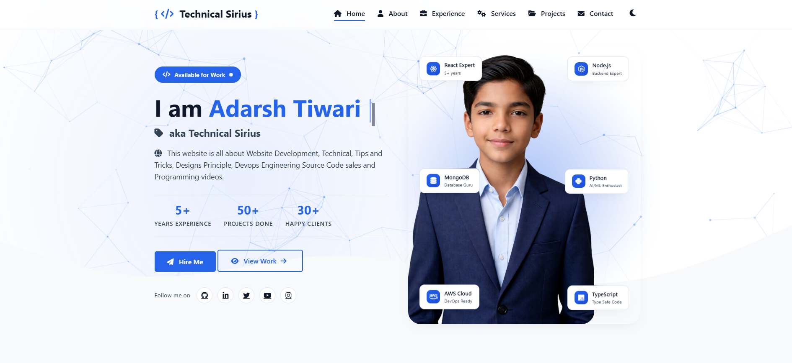

# 🚀 Personal Portfolio Website

Welcome to my personal portfolio website!
This project showcases my skills, projects, and experience as a developer.

---

## 👨‍💻 About Me

Hi, I'm **Adarsh Tiwari** 👋
I am a passionate developer interested in:

* 🌐 Web Development
* ⚙️ DevOps
* 💻 Frontend & Backend Development

---

## 🏷️ Badges

---

## 🌟 Features

* ✨ Modern and responsive design
* 📱 Mobile-friendly layout
* 🎯 Smooth scrolling and animations
* 📂 Project showcase section
* 📞 Contact form / social links

---

## 🛠️ Tech Stack

  

  

---

---

## 🚀 Live Demo

👉 [See My Portfolio](https://technicalsirius.netlify.app/)

---

## 📤 Deployment

You can deploy this project using:

* Netlify
* GitHub Pages
* Vercel

---

## 🤝 Contributing

Contributions are welcome!
Feel free to fork this repo and submit a pull request.

---

## 📧 Contact

* Email: [developeradarshtiwari@gmail.com](mailto:developeradarshtiwari@gmail.com)
* Phone: (91+ 844 567 8290)
* GitHub: (Technical Sirius)

---

## ⭐ Support

If you like this project, give it a ⭐ on GitHub!

---

## 📜 License

This project is open-source and available under the MIT License.

---
